## EJERCICIO 1


1. Diseño de la topología 

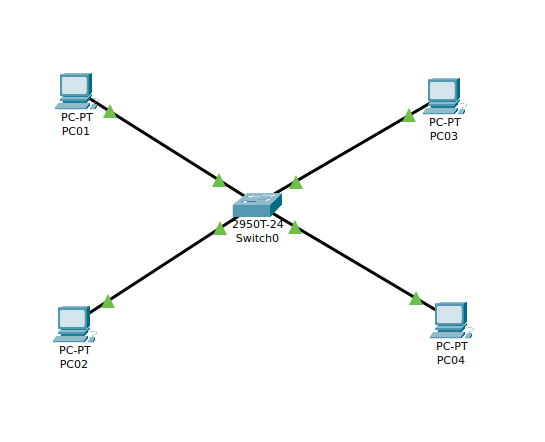

2. Insertar una nueva VLAN, que será la VLAN número 2, con el nombre PRUEBAV2.

Para mostrar las vlan configuradas en el switch ejecutamos:

~~~

estefan_sw#show vlan brief

VLAN Name                             Status    Ports
---- -------------------------------- --------- -------------------------------
1    default                          active    Fa0/1, Fa0/2, Fa0/3, Fa0/4
                                                Fa0/5, Fa0/6, Fa0/7, Fa0/8
                                                Fa0/9, Fa0/10, Fa0/11, Fa0/12
                                                Fa0/13, Fa0/14, Fa0/15, Fa0/16
                                                Fa0/17, Fa0/18, Fa0/19, Fa0/20
                                                Fa0/21, Fa0/22, Fa0/23, Fa0/24
                                                Gig0/1, Gig0/2
1002 fddi-default                     active    
1003 token-ring-default               active    
1004 fddinet-default                  active    
1005 trnet-default                    active 
~~~


3. Para insertar una nueva VLAN ejecutamos:

~~~
estefan_sw#configure 
Configuring from terminal, memory, or network [terminal]? 
Enter configuration commands, one per line.  End with CNTL/Z.
estefan_sw(config)#vlan 2
estefan_sw(config)#vlan 2
estefan_sw(config-vlan)#name PRUEBAV2
~~~

Comprobamos que se ha creado correctamente la nueva VLAN:

~~~
estefan_sw#show vlan brief

VLAN Name                             Status    Ports
---- -------------------------------- --------- -------------------------------
1    default                          active    Fa0/1, Fa0/2, Fa0/3, Fa0/4
                                                Fa0/5, Fa0/6, Fa0/7, Fa0/8
                                                Fa0/9, Fa0/10, Fa0/11, Fa0/12
                                                Fa0/13, Fa0/14, Fa0/15, Fa0/16
                                                Fa0/17, Fa0/18, Fa0/19, Fa0/20
                                                Fa0/21, Fa0/22, Fa0/23, Fa0/24
                                                Gig0/1, Gig0/2
2    PRUEBAV2                         active    
1002 fddi-default                     active    
1003 token-ring-default               active    
1004 fddinet-default                  active    
1005 trnet-default                    active 
~~~

4. Realizar las siguiente configuración de redes VLAN:

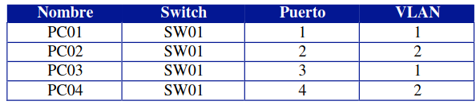

Para ello ejecutamos:

~~~
estefan_sw#configure 
Configuring from terminal, memory, or network [terminal]? 
Enter configuration commands, one per line.  End with CNTL/Z.
estefan_sw(config)#interface  fastEthernet 0/2
estefan_sw(config-if)#switchport access vlan 2
estefan_sw(config-if)#exit
estefan_sw(config)#interface  fastEthernet 0/4
estefan_sw(config-if)#switchport access vlan 2
~~~

Vamos a comprobar que los puertos se han asignado correctamente a cada VLAN:

~~~
estefan_sw#show vlan brief

VLAN Name                             Status    Ports
---- -------------------------------- --------- -------------------------------
1    default                          active    Fa0/1, Fa0/3, Fa0/5, Fa0/6
                                                Fa0/7, Fa0/8, Fa0/9, Fa0/10
                                                Fa0/11, Fa0/12, Fa0/13, Fa0/14
                                                Fa0/15, Fa0/16, Fa0/17, Fa0/18
                                                Fa0/19, Fa0/20, Fa0/21, Fa0/22
                                                Fa0/23, Fa0/24, Gig0/1, Gig0/2
2    PRUEBAV2                         active    Fa0/2, Fa0/4
1002 fddi-default                     active    
1003 token-ring-default               active    
1004 fddinet-default                  active    
1005 trnet-default                    active
~~~

5. Realizar ping entre los diferentes equipos para comprobar que la configuración anterior funciona correctamente.

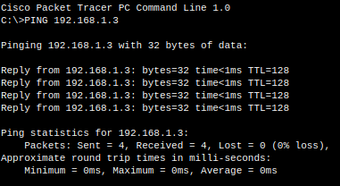

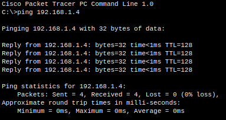


## EJERCICIO 2

1. Montamos la topología de red:

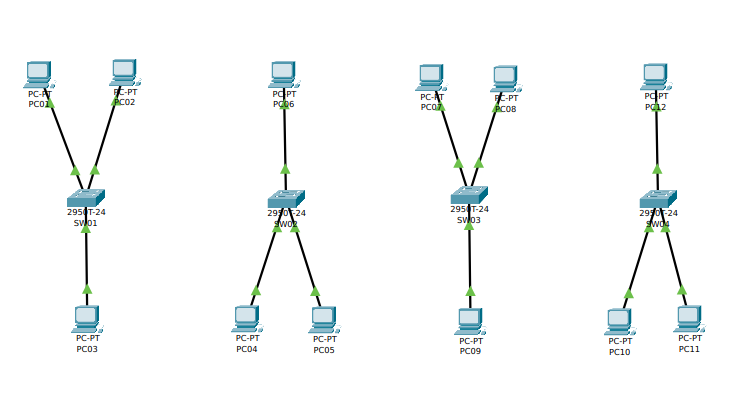

3. Insertar una nueva VLAN, que será la VLAN número 2, con el nombre
PRUEBAV2; VLAN número 3, con el nombre PRUEBAV3.

Ejecutamos en cada switch los comandos:

~~~
estefan_SW01(config)#vlan 2
estefan_SW01(config-vlan)#name PRUEBAV2
estefan_SW01(config-vlan)#exit
estefan_SW01(config)#vlan 3
estefan_SW01(config-vlan)#name PRUEBAV3
~~~

Comprobamos que se han creado correctamente:

~~~
estefan_SW01#show vlan brief

VLAN Name                             Status    Ports
---- -------------------------------- --------- -------------------------------
1    default                          active    Fa0/1, Fa0/2, Fa0/3, Fa0/4
                                                Fa0/5, Fa0/6, Fa0/7, Fa0/8
                                                Fa0/9, Fa0/10, Fa0/11, Fa0/12
                                                Fa0/13, Fa0/14, Fa0/15, Fa0/16
                                                Fa0/17, Fa0/18, Fa0/19, Fa0/20
                                                Fa0/21, Fa0/22, Fa0/23, Fa0/24
                                                Gig0/1, Gig0/2
2    PRUEBAV2                         active    
3    PRUEBAV3                         active    
1002 fddi-default                     active    
1003 token-ring-default               active    
1004 fddinet-default                  active    
1005 trnet-default                    active 
~~~

4. Realizar la siguiente configuración de redes VLAN:

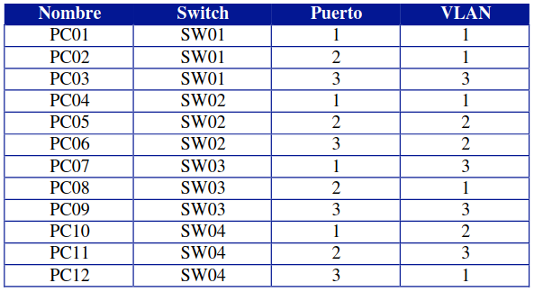

Ejecutamos el código en cada switch siguiente sólo en aquellas máquinas que se conectan a las VLAN2 y VLAN3:

~~~
estefan_SW01(config)#interface fastEthernet 0/3
estefan_SW01(config-if)#switchport access vlan 3
~~~

Ahora que hemos configurado las VLAN, vamos a guardar la configuración del switch, de modo que si lo reiniciamos la cargue, para ello ejecutamos:

~~~
estefan_SW01>enable 
estefan_SW01#copy running-config startup-config 
Destination filename [startup-config]? 
Building configuration...
[OK]
~~~

5. Realizar ping entre los diferentes equipos para comprobar que la configuración de cada equipo funciona correctamente:

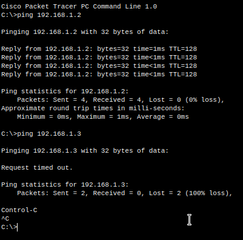

6. Unir los switchs de comunicaciones entre ellos siguiendo el siguiente esquema de conexiones:

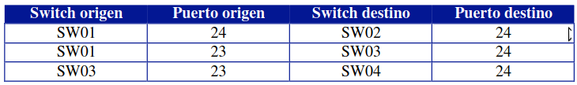

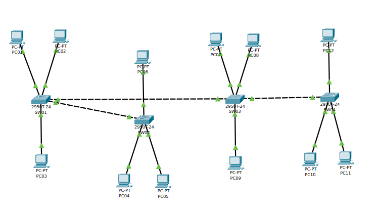

Comprobar que las comunicaciones entre los swichs funcionan correctamente. ¿Es esto cierto? ¿Para qué VLAN funciona correctamente?

Para la VLAN1 vemos que hay comunicación, esto se debe a que es la VLAN por defecto:

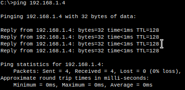

Comprobamos que para VLAN2 no funciona, porque no hay enlace TRUNK entre los switchs:

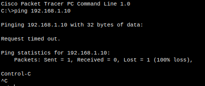

7. Colocar la siguiente configuración de puertos TRUNK de VLAN:

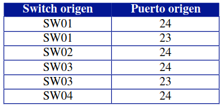

~~~
estefan_SW01(config)#interface fastEthernet 0/24
estefan_SW01(config-if)#switchport mode trunk 
estefan_SW01(config-if)#
%LINEPROTO-5-UPDOWN: Line protocol on Interface FastEthernet0/24, changed state to down

%LINEPROTO-5-UPDOWN: Line protocol on Interface FastEthernet0/24, changed state to up
~~~

Para configurar un puerto como trunk en un switch en Packet Tracer mediante la CLI, puedes usar los siguientes comandos:

+ Entra en modo de configuración global:

```
switch# configure terminal
```

+ Configura el modo de puerto para el puerto específico que deseas usar como trunk:

```
switch(config)# interface interface_number
```

+ Configura el modo de puerto para trunk:

```
switch(config-if)# switchport mode trunk
```

+ Configura los protocolos de VLAN permitidos en el trunk (opcional):

```
switch(config-if)# switchport trunk allowed vlan vlan_list
```

+ Verifica la configuración:

```
switch(config-if)# end
switch# show interfaces interface_number switchport
```

Nota: Reemplaza "interface\_number" y "vlan\_list" con los valores apropiados para tu entorno.

2 / 2

Comprobamos las comunicaciones entre las diferentes VLAN a través de los diferentes equipos:

~~~
estefan_SW01#show interfaces fastEthernet 0/24 switchport 
Name: Fa0/24
Switchport: Enabled
Administrative Mode: trunk
Operational Mode: trunk
Administrative Trunking Encapsulation: dot1q
Operational Trunking Encapsulation: dot1q
Negotiation of Trunking: On
Access Mode VLAN: 1 (default)
Trunking Native Mode VLAN: 1 (default)
Voice VLAN: none
Administrative private-vlan host-association: none
Administrative private-vlan mapping: none
Administrative private-vlan trunk native VLAN: none
Administrative private-vlan trunk encapsulation: dot1q
Administrative private-vlan trunk normal VLANs: none
Administrative private-vlan trunk private VLANs: none
Operational private-vlan: none
Trunking VLANs Enabled: All
Pruning VLANs Enabled: 2-1001
Capture Mode Disabled
Capture VLANs Allowed: ALL
Protected: false
 --More-- 
~~~