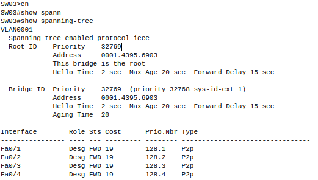
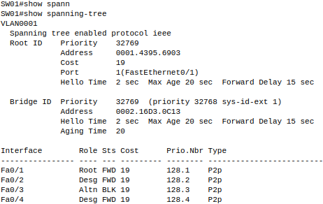
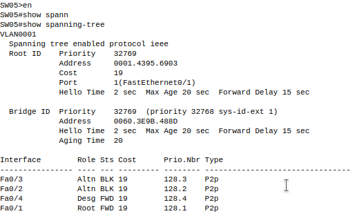
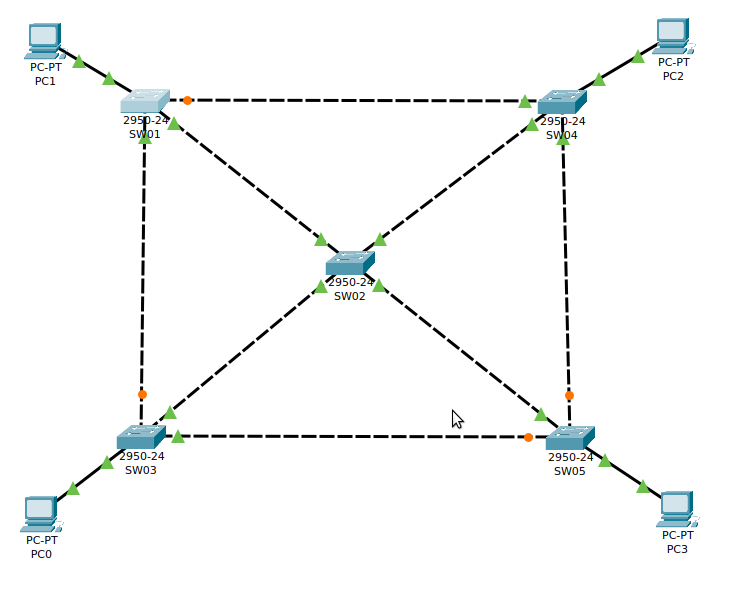
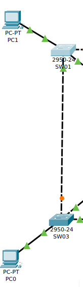
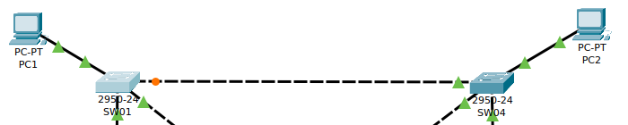
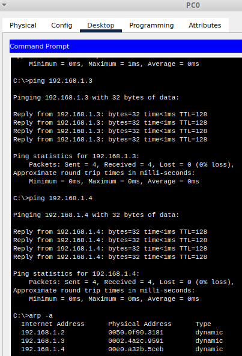
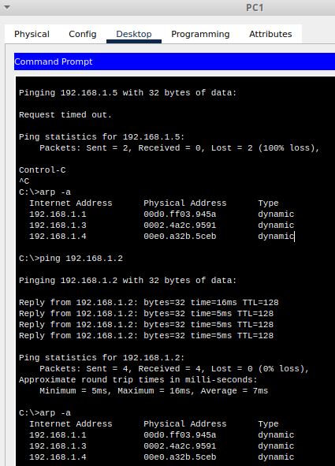
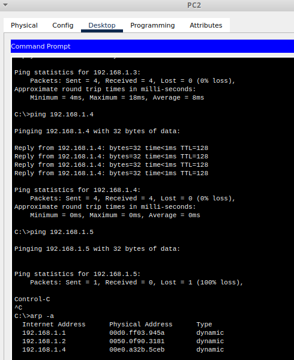
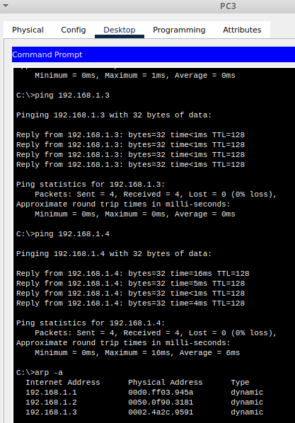

1. Identificar el puerto raíz.

El puerto raíz es el SW02   

2. Identificar los puertos no designados y en que switch se encuentran.

En el SW01:

En el SW03:

En el SW05:

3. Comprobar que ya no existen bucles en nuestra red.

Como se ve en la imagen el protocolo STP ha configurado los puertos de forma que no hay bucles lógicos.

4. Comprobar que existe un camino único entre cada par de switches.

Entre SW01-SW03:

Entre SW01-SW04:

Y así todos los caminos siguientes:

5. Hacer pruebas de conectividad entre todos los equipos de la red.

