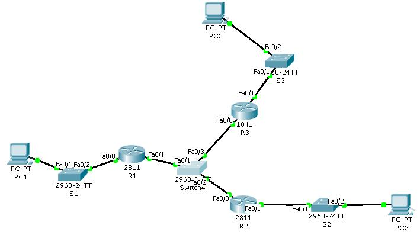
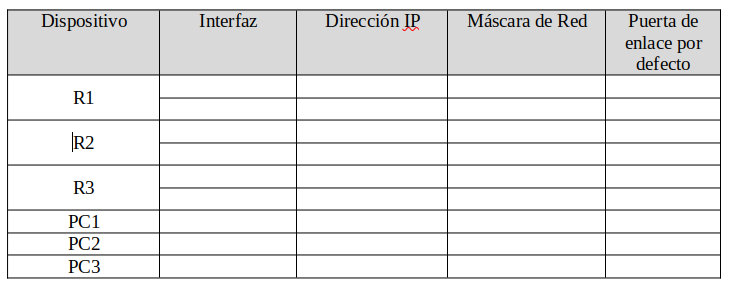

# Ejercicio 

Dado el esquema de red siguiente, montarlo en Packet Tracer, responder a las preguntas y subir la carpeta con todos los archivos al repositorio.



1. Rellena la siguiente tabla (debes quitar la imagen y poner la tabla en markdown, puedes usar este servicio https://www.tablesgenerator.com/):




2. Configura la dirección `IP` y la puerta de enlace para cada `PC`. 

+ PC1

```
ipconfig

FastEthernet0 Connection:(default port)

   Connection-specific DNS Suffix..: 
   Link-local IPv6 Address.........: FE80::2E0:A3FF:FEE5:7486
   IPv6 Address....................: ::
   IPv4 Address....................: 192.168.1.2
   Subnet Mask.....................: 255.255.255.0
   Default Gateway.................: ::
                                     192.168.1.1
```

+ PC2

```
ipconfig

FastEthernet0 Connection:(default port)

   Connection-specific DNS Suffix..: 
   Link-local IPv6 Address.........: FE80::20A:41FF:FE84:DEE8
   IPv6 Address....................: ::
   IPv4 Address....................: 172.23.0.2
   Subnet Mask.....................: 255.255.0.0
   Default Gateway.................: ::
                                     172.23.0.1
```

+ PC3

```
ipconfig

FastEthernet0 Connection:(default port)

   Connection-specific DNS Suffix..: 
   Link-local IPv6 Address.........: FE80::2D0:BCFF:FE25:35C2
   IPv6 Address....................: ::
   IPv4 Address....................: 172.19.0.2
   Subnet Mask.....................: 255.255.0.0
   Default Gateway.................: ::
                                     172.19.0.1
```

3. Configura el nombre de cada Router y de cada switch según el esquema.

Para los routers:

+ R1

```
Router>enable 
Router#configure 
Configuring from terminal, memory, or network [terminal]? 
Enter configuration commands, one per line.  End with CNTL/Z.
Router(config)#hostname R1
```

+ R2

```
Router>enable 
Router#conf
Configuring from terminal, memory, or network [terminal]? 
Enter configuration commands, one per line.  End with CNTL/Z.
Router(config)#hostname R2
```

+ R3

```
Router>enable 
Router#conf
Configuring from terminal, memory, or network [terminal]? 
Enter configuration commands, one per line.  End with CNTL/Z.
Router(config)#hostname R3
```
Para los switch:

+ S1

```
Switch>enable 
Switch#conf
Configuring from terminal, memory, or network [terminal]? 
Enter configuration commands, one per line.  End with CNTL/Z.
Switch(config)#hostname S1
```

+ S2

```
Switch>enable 
Switch#conf
Configuring from terminal, memory, or network [terminal]? 
Enter configuration commands, one per line.  End with CNTL/Z.
Switch(config)#hostname S2
```

+ S3

```
Switch>enable 
Switch#conf
Configuring from terminal, memory, or network [terminal]? 
Enter configuration commands, one per line.  End with CNTL/Z.
Switch(config)#hostname S3
```
+ S4

```
Switch>enable 
Switch#conf
Configuring from terminal, memory, or network [terminal]? 
Enter configuration commands, one per line.  End with CNTL/Z.
Switch(config)#hostname S4
```

4. Configura las direcciones `IP` de cada router.

+ R1

```
R1(config)#interface fastEthernet 0/1
R1(config-if)#ip address 10.0.0.1 255.255.255.0
R1(config-if)#no shutdown
R1(config-if)#exit
R1(config)#interface fastEthernet 0/0
R1(config-if)#ip address 192.168.1.1 255.255.255.0
R1(config-if)#no shutdown
```

+ R2

```
R2(config)#interface fastEthernet 0/1
R2(config-if)#ip address 172.23.0.1 255.255.0.0
R2(config-if)#no shutdown
R2(config-if)#exit
R2(config)#interface fastEthernet 0/0
R2(config-if)#ip address 10.0.0.2 255.255.255.0
R2(config-if)#no shutdown 
```

+ R3

```
R3(config)#interface fastEthernet 0/1
R3(config-if)#ip address 172.19.0.1 255.255.255.0
R3(config-if)#no shutdown 
R3(config-if)#exit
R3(config)#interface fastEthernet 0/0
R3(config-if)#ip address 10.0.0.3 255.255.255.0
R3(config-if)#no shutdown
```
5. Comprueba que has configurado las  direcciones `IP` bien. Para ello ejecuta el comando `show ip interface brief` en los tres Routers y cópialo en las siguientes cajas de código.

+ R1

```
R1(config)#interface gigabitEthernet 0/0
R1(config-if)#ip address 192.168.1.1 255.255.255.0
R1(config-if)#description IP R1
R1(config-if)#exit
R1(config)#interface gigabitEthernet 0/1
R1(config-if)#ip address 10.0.0.1 255.255.255.0
R1(config-if)#description IP R1 10
R1(config-if)#
```

+ R2

```
R2(config)#interface gigabitEthernet 0/0
R2(config-if)#ip address 172.19.0.1 255.255.0.0
R2(config-if)#description IP R2
R2(config-if)#exit
R2(config)#interface gigabitEthernet 0/1
R2(config-if)#ip address 10.0.0.2 255.255.255.0
R2(config-if)#description IP R2 10
```

+ R3

```
R3(config)#interface gigabitEthernet 0/0
R3(config-if)#ip address 172.23.1.1 255.255.0.0
R3(config-if)#description IP R3
R3(config-if)#exit
R3(config)#interface gigabitEthernet 0/1
R3(config-if)#ip address 10.0.0.3 255.255.255.0
R3(config-if)#description IP R3 10
```
6. Comprueba la tabla de encaminamiento en cada Router y muéstralo en las siguientes cajas de código:

+ R1

```
R1#show arp
Protocol  Address          Age (min)  Hardware Addr   Type   Interface
Internet  10.0.0.1                -   0090.2BED.5102  ARPA   FastEthernet0/1
Internet  192.168.1.1             -   0090.2BED.5101  ARPA   FastEthernet0/0
```

+ R2

```
R2#show arp
Protocol  Address          Age (min)  Hardware Addr   Type   Interface
Internet  10.0.0.2                -   0090.21AD.9C01  ARPA   FastEthernet0/0
Internet  172.23.0.1              -   0090.21AD.9C02  ARPA   FastEthernet0/1
```

+ R3

```
R3#show arp
Protocol  Address          Age (min)  Hardware Addr   Type   Interface
Internet  10.0.0.2                -   0006.2A3D.8B01  ARPA   FastEthernet0/0
Internet  172.23.0.1              -   0006.2A3D.8B02  ARPA   FastEthernet0/1
```

7. Prueba a hacer un ping desde el `R1` a `PC1`, desde `R2` a `PC2` y desde `R3` a `PC3`. Muestra el resultado en la siguiente caja de código:

+ R1-> PC1

```
ping 192.168.1.1

Pinging 192.168.1.1 with 32 bytes of data:

Reply from 192.168.1.1: bytes=32 time<1ms TTL=255
Reply from 192.168.1.1: bytes=32 time<1ms TTL=255
Reply from 192.168.1.1: bytes=32 time<1ms TTL=255

Ping statistics for 192.168.1.1:
    Packets: Sent = 3, Received = 3, Lost = 0 (0% loss),
Approximate round trip times in milli-seconds:
    Minimum = 0ms, Maximum = 0ms, Average = 0ms
```

+ R2-> PC2

```
ping 172.23.0.0

Pinging 172.23.0.0 with 32 bytes of data:

Request timed out.
Reply from 172.23.0.1: bytes=32 time<1ms TTL=255
Reply from 172.23.0.1: bytes=32 time<1ms TTL=255

Ping statistics for 172.23.0.0:
    Packets: Sent = 3, Received = 2, Lost = 1 (34% loss),
Approximate round trip times in milli-seconds:
    Minimum = 0ms, Maximum = 0ms, Average = 0ms

```

+ R3-> PC3

```
ping 172.19.0.0

Pinging 172.19.0.0 with 32 bytes of data:

Reply from 172.19.0.1: bytes=32 time<1ms TTL=255
Reply from 172.19.0.1: bytes=32 time=4ms TTL=255
Reply from 172.19.0.1: bytes=32 time<1ms TTL=255

Ping statistics for 172.19.0.0:
    Packets: Sent = 3, Received = 3, Lost = 0 (0% loss),
Approximate round trip times in milli-seconds:
    Minimum = 0ms, Maximum = 4ms, Average = 1ms
```
8. Prueba a hacer ping desde el `PC1` al `PC2`, desde el `PC2` al `PC3`. ¿Porqué no funciona? Escribe una breve descripción de porque no funciona.

+ PC1-> PC2

```
ping 172.23.0.2

Pinging 172.23.0.2 with 32 bytes of data:

Reply from 172.23.0.2: bytes=32 time<1ms TTL=126
Reply from 172.23.0.2: bytes=32 time=16ms TTL=126
Reply from 172.23.0.2: bytes=32 time<1ms TTL=126

Ping statistics for 172.23.0.2:
    Packets: Sent = 3, Received = 3, Lost = 0 (0% loss),
Approximate round trip times in milli-seconds:
    Minimum = 0ms, Maximum = 16ms, Average = 5ms
```

+ PC2-> PC3

```
ping 172.19.0.2

Pinging 172.19.0.2 with 32 bytes of data:

Reply from 172.19.0.2: bytes=32 time<1ms TTL=125
Reply from 172.19.0.2: bytes=32 time<1ms TTL=125
Reply from 172.19.0.2: bytes=32 time<1ms TTL=125

Ping statistics for 172.19.0.2:
    Packets: Sent = 3, Received = 3, Lost = 0 (0% loss),
Approximate round trip times in milli-seconds:
    Minimum = 0ms, Maximum = 0ms, Average = 0ms
```
9. Copia los comandos que han permitido que funcione.

```
R1

R1(config)#ip route 172.19.0.0 255.255.0.0 10.0.0.3
R1(config)#ip route 172.23.0.0 255.255.0.0 10.0.0.2

R2

R2(config)#ip route 192.168.1.0 255.255.255.0 10.0.0.1
R2(config)#ip route 172.19.0.0 255.255.0.0 10.0.0.3

R3

R3(config)#ip route 192.168.1.0 255.255.255.0 10.0.0.1
R3(config)#ip route 172.23.0.0 255.255.0.0 10.0.0.2
```
10. Muestra el resultado de las tablas de encaminamiento de los tres routers:

+ R1

```
R1#show ip route
Codes: L - local, C - connected, S - static, R - RIP, M - mobile, B - BGP
       D - EIGRP, EX - EIGRP external, O - OSPF, IA - OSPF inter area
       N1 - OSPF NSSA external type 1, N2 - OSPF NSSA external type 2
       E1 - OSPF external type 1, E2 - OSPF external type 2, E - EGP
       i - IS-IS, L1 - IS-IS level-1, L2 - IS-IS level-2, ia - IS-IS inter area
       * - candidate default, U - per-user static route, o - ODR
       P - periodic downloaded static route

Gateway of last resort is not set

     10.0.0.0/8 is variably subnetted, 2 subnets, 2 masks
C       10.0.0.0/24 is directly connected, FastEthernet0/1
L       10.0.0.1/32 is directly connected, FastEthernet0/1
S    172.19.0.0/16 [1/0] via 10.0.0.3
S    172.23.0.0/16 [1/0] via 10.0.0.2
     192.168.1.0/24 is variably subnetted, 2 subnets, 2 masks
C       192.168.1.0/24 is directly connected, FastEthernet0/0
L       192.168.1.1/32 is directly connected, FastEthernet0/0
```

+ R2

```
R2#show ip route
Codes: L - local, C - connected, S - static, R - RIP, M - mobile, B - BGP
       D - EIGRP, EX - EIGRP external, O - OSPF, IA - OSPF inter area
       N1 - OSPF NSSA external type 1, N2 - OSPF NSSA external type 2
       E1 - OSPF external type 1, E2 - OSPF external type 2, E - EGP
       i - IS-IS, L1 - IS-IS level-1, L2 - IS-IS level-2, ia - IS-IS inter area
       * - candidate default, U - per-user static route, o - ODR
       P - periodic downloaded static route

Gateway of last resort is not set

     10.0.0.0/8 is variably subnetted, 2 subnets, 2 masks
C       10.0.0.0/16 is directly connected, FastEthernet0/0
L       10.0.0.2/32 is directly connected, FastEthernet0/0
S    172.19.0.0/16 [1/0] via 10.0.0.3
     172.23.0.0/16 is variably subnetted, 2 subnets, 2 masks
C       172.23.0.0/16 is directly connected, FastEthernet0/1
L       172.23.0.1/32 is directly connected, FastEthernet0/1
S    192.168.1.0/24 [1/0] via 10.0.0.1
```

+ R3

```
R3#show ip route
Codes: C - connected, S - static, I - IGRP, R - RIP, M - mobile, B - BGP
       D - EIGRP, EX - EIGRP external, O - OSPF, IA - OSPF inter area
       N1 - OSPF NSSA external type 1, N2 - OSPF NSSA external type 2
       E1 - OSPF external type 1, E2 - OSPF external type 2, E - EGP
       i - IS-IS, L1 - IS-IS level-1, L2 - IS-IS level-2, ia - IS-IS inter area
       * - candidate default, U - per-user static route, o - ODR
       P - periodic downloaded static route

Gateway of last resort is not set

     10.0.0.0/24 is subnetted, 1 subnets
C       10.0.0.0 is directly connected, FastEthernet0/0
C    172.19.0.0/16 is directly connected, FastEthernet0/1
S    172.23.0.0/16 [1/0] via 10.0.0.2
S    192.168.1.0/24 [1/0] via 10.0.0.1
```