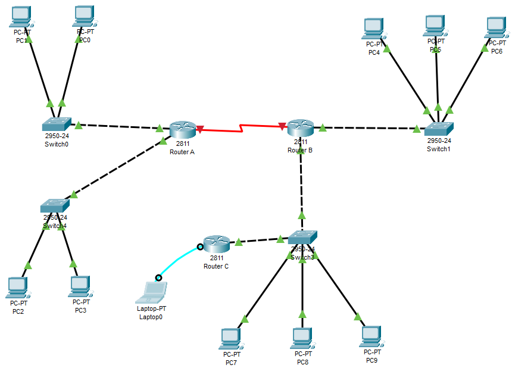

# EJERCICIO DE TABLAS DE ENCAMINAMIENTO

Dado el siguiente esquema:


1. Rellena las tablas de encaminamiento del `Router A`, `Router B` y `Router C` (usa las tablas que te suministra el profesor):

+ Router A
 
```
| DIRECCION DE RED |    MASCARA    |   ENCAMINADOR  | INTERFAZ | METRICA |
|:----------------:|:-------------:|:--------------:|:--------:|:-------:|
|    186.150.0.0   |  255.255.0.0  |     0.0.0.0    |    L1    |    0    |
|   199.240.10.0   | 255.255.255.0 |     0.0.0.0    |    L3    |    0    |
|   192.168.232.0  | 255.255.255.0 |     0.0.0.0    |    L2    |    0    |
|     103.0.0.0    |   255.0.0.0   | 192.168.232.34 |    L2    |    1    |
|   219.240.10.0   | 255.255.255.0 | 192.168.232.34 |    L2    |    1    |
|      0.0.0.0     |    0.0.0.0    | 192.168.232.34 |    L2    |    1    |
```


+ Router B

```
| DIRECCION DE RED |    MASCARA    |   ENCAMINADOR  | INTERFAZ | METRICA |
|:----------------:|:-------------:|:--------------:|:--------:|:-------:|
|     103.0.0.0    |   255.0.0.0   |     0.0.0.0    |    L2    |    0    |
|   219.240.10.0   | 255.255.255.0 |     0.0.0.0    |    L3    |    0    |
|   192.168.232.0  | 255.255.255.0 |     0.0.0.0    |    L1    |    0    |
|    186.150.0.0   |  255.255.0.0  | 192.168.232.25 |    L1    |    1    |
|   199.240.10.0   | 255.255.255.0 | 192.168.232.25 |    L1    |    1    |
|      0.0.0.0     |    0.0.0.0    | 192.168.232.25 |    L1    |    1    |
```

+ Router C

```
| DIRECCION DE RED |    MASCARA    |  ENCAMINADOR  | INTERFAZ | METRICA |
|:----------------:|:-------------:|:-------------:|:--------:|:-------:|
|   219.240.10.0   | 255.255.255.0 |    0.0.0.0    |    L1    |    0    |
|     103.0.0.0    |   255.0.0.0   | 219.240.10.25 |    L1    |    1    |
|   192.168.232.0  | 255.255.255.0 | 219.240.10.25 |    L1    |    1    |
|    186.150.0.0   |  255.255.0.0  | 219.240.10.25 |    L1    |    2    |
|   199.240.10.0   | 255.255.255.0 | 219.240.10.25 |    L1    |    2    |
|      0.0.0.0     |    0.0.0.0    | 219.240.10.25 |    L1    |    1    |
```

2. Realiza en Packet Tracer el diagrama de red tal y como el que se adjunta. Debes poner las direcciones ip que se indican así como los carteles. Configura en cada `PC` los parámetros de la red que le corresponden. Pon una imagen del resultado de tu montaje.




3. Establece el nombre de cada uno de los routers:

+ Router A

```
Router>enable
Router#conf
Configuring from terminal, memory, or network [terminal]? 
Enter configuration commands, one per line.  End with CNTL/Z.
Router(config)#hostname RouterA
```

+ Router B

```
Router>enable
Router#conf
Configuring from terminal, memory, or network [terminal]? 
Enter configuration commands, one per line.  End with CNTL/Z.
Router(config)#hostname RouterB
```

+ Router C

```
Router>enable
Router#conf
Configuring from terminal, memory, or network [terminal]? 
Enter configuration commands, one per line.  End with CNTL/Z.
Router(config)#hostname RouterC
```

4. Configura el mensaje de bienvenida a cada uno de los routers `ROUTER A NOMBRE_ALUMNO`:

+ Router A

```
RouterA(config)#banner motd #
Enter TEXT message.  End with the character '#'.
ROUTER A ESTEFAN
#
```

+ Router B

```
RouterB(config)#banner motd #
Enter TEXT message.  End with the character '#'.
ROUTER B ESTEFAN
#
```

+ Router C

```
RouterC(config)#banner motd #
Enter TEXT message.  End with the character '#'.
ROUTER C ESTEFAN
#
```


5. Establece para cada router la contraseña `cisco2223` para el acceso a la configuración:

+ Router A

```
RouterA(config)#enable secret cisco2223
```

+ Router B

```
RouterB(config)#enable secret cisco2223
```

+ Router C

```
RouterC(config)#enable secret cisco2223
```

6. Configura las direcciones `IP` de cada una de las interfaces de los routers:

+ Router A

```
RouterA(config-if)#ip address 186.150.130.89 255.255.0.0
RouterA(config-if)#no shutdown
RouterA(config-if)#exit
RouterA(config)#interface FastEthernet0/1
RouterA(config-if)#ip address 199.240.10.43 255.255.255.0
RouterA(config-if)#no shutdown
```

+ Router B

```
RouterB(config)#interface fastEthernet 0/0
RouterB(config-if)#ip address 103.150.164.7 255.0.0.0
RouterB(config-if)#no shutdown
RouterB(config-if)#exit
RouterB(config)#interface fastEthernet 0/1
RouterB(config-if)#ip address 219.240.10.56 255.255.255.0
RouterB(config-if)#no shutdown 
```

+ Router C

```
RouterC(config)#interface fastEthernet 0/0
RouterC(config-if)#ip address 219.240.10.56 255.255.255.0
RouterC(config-if)#no shutdown
```

7. Muestra un resumen de la configuración de las interfaces de cada router:

+ Router A

```
RouterA#show ip interface brief
Interface              IP-Address      OK? Method Status                Protocol 
FastEthernet0/0        186.150.130.89  YES manual up                    up 
FastEthernet0/1        199.240.10.43   YES manual up                    up 
Serial0/2/0            unassigned      YES unset  administratively down down 
Serial0/2/1            unassigned      YES unset  administratively down down 
Vlan1                  unassigned      YES unset  administratively down down
```

+ Router B

```
RouterB#show ip interface brief
Interface              IP-Address      OK? Method Status                Protocol 
FastEthernet0/0        103.150.164.7   YES manual up                    up 
FastEthernet0/1        219.240.10.56   YES manual up                    up 
Serial0/2/0            unassigned      YES unset  administratively down down 
Serial0/2/1            unassigned      YES unset  administratively down down 
Vlan1                  unassigned      YES unset  administratively down down
```

+ Router C

```
RouterC#show ip interface brief
Interface              IP-Address      OK? Method Status                Protocol 
FastEthernet0/0        219.240.10.56   YES manual up                    up 
FastEthernet0/1        unassigned      YES unset  administratively down down 
Serial0/2/0            unassigned      YES unset  administratively down down 
Serial0/2/1            unassigned      YES unset  administratively down down 
Vlan1                  unassigned      YES unset  administratively down down
```


8. Configura en cada router las rutas estáticas en base las tablas que has rellenado en el apartado 1:

+ Router A

```
RouterA(config)#ip route 186.150.0.0 255.255.0.0 0.0.0.0
RouterA(config)#ip route 199.240.10.0 255.255.255.0 0.0.0.0
RouterA(config)#ip route 192.168.232.0 255.255.255.0 0.0.0.0
RouterA(config)#ip route 103.0.0.0 255.0.0.0 192.168.232.34
RouterA(config)#ip route 219.240.10.0 255.255.255.0 192.168.232.34
RouterA(config)#ip route 0.0.0.0 0.0.0.0 192.168.232.34
```

+ Router B

```
RouterB(config)#ip route 103.0.0.0 255.0.0.0 0.0.0.0
RouterB(config)#ip route 219.240.10.0 255.255.255.0 0.0.0.0
RouterB(config)#ip route 192.168.232.0 255.255.255.0 0.0.0.0
RouterB(config)#ip route 186.150.0.0 255.255.0.0 192.168.232.25
RouterB(config)#ip route 199.240.10.0 255.255.255.0 192.168.232.25
RouterB(config)#ip route 0.0.0.0 0.0.0.0 192.168.232.25
```

+ Router C

```
RouterC(config)#ip route 219.240.10.0 255.255.255.0 0.0.0.0
RouterC(config)#ip route 103.0.0.0 255.0.0.0 219.240.10.25
RouterC(config)#ip route 192.168.232.0 255.255.255.0 219.240.10.25
RouterC(config)#ip route 186.150.0.0 255.255.0.0 219.240.10.25
RouterC(config)#ip route 199.240.10.0 255.255.255.0 219.240.10.25
RouterC(config)#ip route 0.0.0.0 0.0.0.0 219.240.10.25
```

9. Muestra la tabla de enrutamiendo de cada router:

+ Router A

```
RouterA#show ip route
Codes: L - local, C - connected, S - static, R - RIP, M - mobile, B - BGP
       D - EIGRP, EX - EIGRP external, O - OSPF, IA - OSPF inter area
       N1 - OSPF NSSA external type 1, N2 - OSPF NSSA external type 2
       E1 - OSPF external type 1, E2 - OSPF external type 2, E - EGP
       i - IS-IS, L1 - IS-IS level-1, L2 - IS-IS level-2, ia - IS-IS inter area
       * - candidate default, U - per-user static route, o - ODR
       P - periodic downloaded static route

Gateway of last resort is not set

     186.150.0.0/16 is variably subnetted, 2 subnets, 2 masks
C       186.150.0.0/16 is directly connected, FastEthernet0/0
L       186.150.130.89/32 is directly connected, FastEthernet0/0
     199.240.10.0/24 is variably subnetted, 2 subnets, 2 masks
C       199.240.10.0/24 is directly connected, FastEthernet0/1
L       199.240.10.43/32 is directly connected, FastEthernet0/1
```

+ Router B

```
RouterB#show ip route
Codes: L - local, C - connected, S - static, R - RIP, M - mobile, B - BGP
       D - EIGRP, EX - EIGRP external, O - OSPF, IA - OSPF inter area
       N1 - OSPF NSSA external type 1, N2 - OSPF NSSA external type 2
       E1 - OSPF external type 1, E2 - OSPF external type 2, E - EGP
       i - IS-IS, L1 - IS-IS level-1, L2 - IS-IS level-2, ia - IS-IS inter area
       * - candidate default, U - per-user static route, o - ODR
       P - periodic downloaded static route

Gateway of last resort is not set

     103.0.0.0/8 is variably subnetted, 2 subnets, 2 masks
C       103.0.0.0/8 is directly connected, FastEthernet0/0
L       103.150.164.7/32 is directly connected, FastEthernet0/0
     219.240.10.0/24 is variably subnetted, 2 subnets, 2 masks
C       219.240.10.0/24 is directly connected, FastEthernet0/1
L       219.240.10.56/32 is directly connected, FastEthernet0/1
```

+ Router C

```
RouterC#show ip route
Codes: L - local, C - connected, S - static, R - RIP, M - mobile, B - BGP
       D - EIGRP, EX - EIGRP external, O - OSPF, IA - OSPF inter area
       N1 - OSPF NSSA external type 1, N2 - OSPF NSSA external type 2
       E1 - OSPF external type 1, E2 - OSPF external type 2, E - EGP
       i - IS-IS, L1 - IS-IS level-1, L2 - IS-IS level-2, ia - IS-IS inter area
       * - candidate default, U - per-user static route, o - ODR
       P - periodic downloaded static route

Gateway of last resort is 219.240.10.25 to network 0.0.0.0

S    103.0.0.0/8 [1/0] via 219.240.10.25
S    186.150.0.0/16 [1/0] via 219.240.10.25
S    192.168.232.0/24 [1/0] via 219.240.10.25
S    199.240.10.0/24 [1/0] via 219.240.10.25
     219.240.10.0/24 is variably subnetted, 2 subnets, 2 masks
C       219.240.10.0/24 is directly connected, FastEthernet0/0
L       219.240.10.56/32 is directly connected, FastEthernet0/0
S*   0.0.0.0/0 [1/0] via 219.240.10.25
```

10. Antes de hacer `ping` entre hosts muestra la tabla `arp` de los routers y de un `PC` de cada red:

+ Router A

```
RouterA#show ip arp
Protocol  Address          Age (min)  Hardware Addr   Type   Interface
Internet  186.150.130.89          -   0060.5C3B.5A01  ARPA   FastEthernet0/0
Internet  199.240.10.43           -   0060.5C3B.5A02  ARPA   FastEthernet0/1
```

+ Router B

```
RouterB#show ip arp
Protocol  Address          Age (min)  Hardware Addr   Type   Interface
Internet  103.150.164.7           -   0004.9A3C.D901  ARPA   FastEthernet0/0
Internet  219.240.10.56           -   0004.9A3C.D902  ARPA   FastEthernet0/1
```

+ Router C

```
RouterC#show ip arp
Protocol  Address          Age (min)  Hardware Addr   Type   Interface
Internet  219.240.10.56           -   0060.2F6C.0701  ARPA   FastEthernet0/0
```

+ PC de la RED 1

```
arp -a
No ARP Entries Found
``` 

+ PC de la RED 2

```
arp -a
No ARP Entries Found
``` 

+ PC de la RED 3

```
arp -a
No ARP Entries Found
``` 


11. Realiza un un ping entre un PC de cada una de las redes con otro para comprobar la conectividad:

+ RED 1 -> RED 2

```
ping 103.150.164.15
``` 

+ RED 1 -> RED 3

```
ping 219.240.10.101
``` 

+ RED 2 -> RED 1

```
ping 186.150.130.1
``` 

+ RED 2 -> RED 3

```
ping 219.240.10.5
``` 

+ RED 3 -> RED 1

```
ping 186.150.164.15
``` 

+ RED 3 -> RED 2

```
ping 103.150.164.15
``` 

12. Vuelve a  mostrar la tabla `arp` de los routers y de un `PC` de cada red:

+ Router A

```
RouterA#show ip arp
Protocol  Address          Age (min)  Hardware Addr   Type   Interface
Internet  186.150.130.89          -   0060.5C3B.5A01  ARPA   FastEthernet0/0
Internet  186.150.164.15          8   000A.F396.209B  ARPA   FastEthernet0/0
Internet  199.240.10.43           -   0060.5C3B.5A02  ARPA   FastEthernet0/1
```

+ Router B

```
RouterB#show ip arp
Protocol  Address          Age (min)  Hardware Addr   Type   Interface
Internet  103.150.164.7           -   0004.9A3C.D901  ARPA   FastEthernet0/0
Internet  103.150.164.15          7   00E0.B09D.D1BE  ARPA   FastEthernet0/0
Internet  219.240.10.5            5   0060.47D8.C29C  ARPA   FastEthernet0/1
Internet  219.240.10.56           -   0004.9A3C.D902  ARPA   FastEthernet0/1
```

+ Router C

```
RouterC#show ip arp
Protocol  Address          Age (min)  Hardware Addr   Type   Interface
Internet  219.240.10.5            6   0060.47D8.C29C  ARPA   FastEthernet0/0
Internet  219.240.10.56           -   0060.2F6C.0701  ARPA   FastEthernet0/0
```

+ PC de la RED 1

```
arp -a
  Internet Address      Physical Address      Type
  186.150.130.89        0060.5c3b.5a01        dynamic
``` 

+ PC de la RED 2

```
arp -a
  Internet Address      Physical Address      Type
  103.150.164.7         0004.9a3c.d901        dynamic
``` 

+ PC de la RED 3

```
arp -a
  Internet Address      Physical Address      Type
  219.240.10.56         0004.9a3c.d902        dynamic
``` 

13. Salva la configuración de cada uno de los routers:

+ Router A

```
RouterA#copy running-config startup-config 
Destination filename [startup-config]? 
Building configuration...
[OK]
```

+ Router B

```
RouterB#copy running-config startup-config 
Destination filename [startup-config]? 
Building configuration...
[OK]
```

+ Router C

```
RouterC#copy running-config startup-config 
Destination filename [startup-config]? 
Building configuration...
[OK]
```
