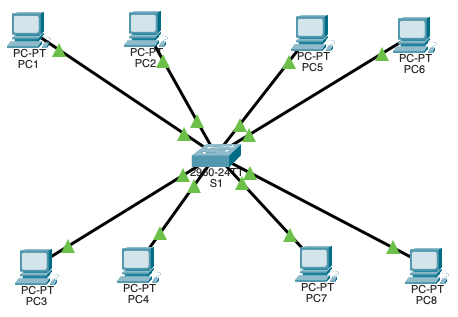
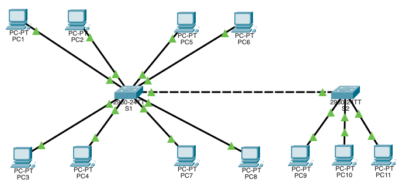
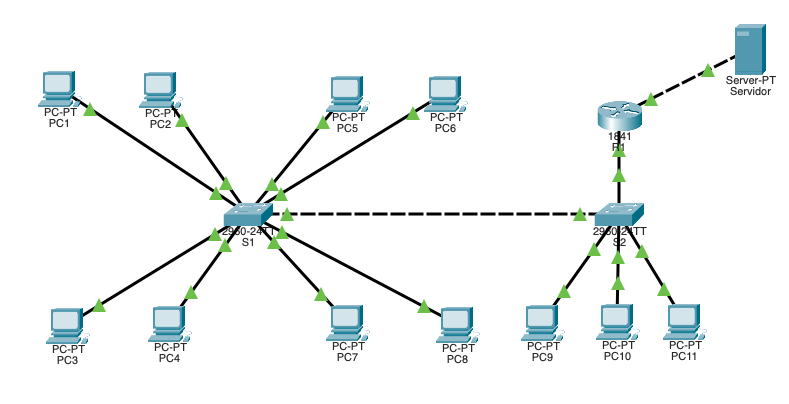

# PRACTICANDO CONFIGURACIONES DE VLAN

### EJERCICIO-1

1. Cambia el nombre del switch a **S1**.

~~~
Switch(config)#hostname S1
~~~

2. Creamos las VLAN y le asignamos un nombre a cada siguiendo el criterio:

+ vlan 10 -> **proyecto10**

~~~
S1(config)#vlan 10
S1(config-vlan)#name proyecto10
~~~

+ vlan 20 -> **proyecto20**

~~~
S1(config-vlan)#vlan 20
S1(config-vlan)#name proyecto20
~~~

+ vlan 30 -> **proyecto30**

~~~
S1(config-vlan)#vlan 30
S1(config-vlan)#name proyecto30
~~~

3. Asignamos las máquinas a cada una de las vlan creadas siguiendo el criterio siguiente:

+ PC1, PC5 y PC8 forman el equipo de trabajo para el desarrollo del **proyecto10**

~~~
S1(config)#interface fastEthernet 0/1
S1(config-if)#switchport access vlan 10
S1(config-if)#exit
S1(config)#interface fastEthernet 0/5
S1(config-if)#switchport access vlan 10
S1(config-if)#exit
S1(config)#interface fastEthernet 0/8
S1(config-if)#switchport access vlan 10
S1(config-if)#exit
~~~

+ PC2 y PC6 forman el grupo de trabajo para el desarrollo del **proyecto20**

~~~
S1(config)#interface fastEthernet 0/2
S1(config-if)#switchport access vlan 20
S1(config-if)#exit
S1(config)#interface fastEthernet 0/6
S1(config-if)#switchport access vlan 20
S1(config-if)#exit
~~~

+ PC3, PC4 y PC7 forman el grupo de trabajo para el desarrollo del **proyecto30**

~~~
S1(config)#interface fastEthernet 0/3
S1(config-if)#switchport access vlan 30
S1(config-if)#exit
S1(config)#interface fastEthernet 0/4
S1(config-if)#switchport access vlan 30
S1(config-if)#exit
S1(config)#interface fastEthernet 0/7
S1(config-if)#switchport access vlan 30
~~~
4. Muestra  un resumen de las redes vlan creadas:

~~~
S1#show vlan brief 

VLAN Name                             Status    Ports
---- -------------------------------- --------- -------------------------------
1    default                          active    Fa0/9, Fa0/10, Fa0/11, Fa0/12
                                                Fa0/13, Fa0/14, Fa0/15, Fa0/16
                                                Fa0/17, Fa0/18, Fa0/19, Fa0/20
                                                Fa0/21, Fa0/22, Fa0/23, Fa0/24
                                                Gig0/1, Gig0/2
10   proyecto10                       active    Fa0/1, Fa0/5, Fa0/8
20   proyecto20                       active    Fa0/2, Fa0/6
30   proyecto30                       active    Fa0/3, Fa0/4, Fa0/7
1002 fddi-default                     active    
1003 token-ring-default               active    
1004 fddinet-default                  active    
1005 trnet-default                    active
~~~

5. Configuramos las direcciones `ip`de cada uno de los equipos siguiendo el siguiente criterio:

+ Vlan 10 -> proyecto10 -> 10.0.10.0/24
+ Vlan 20 -> proyecto20 -> 10.0.20.0/24
+ Vlan 30 -> proyecto30 -> 10.0.30.0/24

Una vez hecho esto comprobar que sólo hay comunicación entre los distintos equipos que forman parte de la misma red `VLAN`.

~~~
Estando en el PC1:

C:\>ping 10.0.10.5

Pinging 10.0.10.5 with 32 bytes of data:

Reply from 10.0.10.5: bytes=32 time<1ms TTL=128
Reply from 10.0.10.5: bytes=32 time<1ms TTL=128
Reply from 10.0.10.5: bytes=32 time<1ms TTL=128
Reply from 10.0.10.5: bytes=32 time<1ms TTL=128

Ping statistics for 10.0.10.5:
    Packets: Sent = 4, Received = 4, Lost = 0 (0% loss),
Approximate round trip times in milli-seconds:
    Minimum = 0ms, Maximum = 0ms, Average = 0ms
~~~

### EJERCICIO-2

Partiendo del ejercicio de un switch ya resuelto, añadir un switch S2 conectado a S1. Este switch tendrá:

+ En el puerto 9 el equipo `PC9` del **proyecto10**.
+ En el puerto 10 el equipo `PC10` del **proyecto20**.
+ En el puerto 11 el equipo `PC11` del **proyecto30**.
+ El troncal estará en el primer puerto gigabitethernet de los dos switches

>***NOTA-1***: Conectamos los equipos al switch y les asignamos a cada uno de ellos las `ip`correspondientes **PERO NO CONFIGURAMOS NINGUNA VLAN EN EL SEGUNDO SWTICH**, ya que vamos a hacer uso del protocolo **VTP** para que el primer switch se comporte como **servidor** y el segundo como **cliente**

>***NOTA-2***: no conectar los dos switches entre sí hasta no configurar el **VTP**

1. Configura el switch S1 como **servidor** dentro del protocolo **VTP**

~~~
S1(config)#vtp mode server
Device mode already VTP SERVER.
S1(config)#vtp domain Estefan
Changing VTP domain name from NULL to Estefan
~~~

2. Muestra el estado del protocolo **VTP** en el switch S1

~~~
S1#show vtp status
VTP Version capable             : 1 to 2
VTP version running             : 1
VTP Domain Name                 : Estefan
VTP Pruning Mode                : Disabled
VTP Traps Generation            : Disabled
Device ID                       : 0001.C9B2.7500
Configuration last modified by 0.0.0.0 at 3-1-93 00:04:13
Local updater ID is 0.0.0.0 (no valid interface found)

Feature VLAN : 
--------------
VTP Operating Mode                : Server
Maximum VLANs supported locally   : 255
Number of existing VLANs          : 8
Configuration Revision            : 0
MD5 digest                        : 0xDB 0xAA 0x29 0x7F 0xE0 0x3F 0x19 0x5B 
                                    0x03 0xA4 0x90 0xD6 0xC3 0x66 0x78 0x48
~~~

3. Configura el puerto `Gig0/1` en modo **troncal**

~~~
S1(config)#interface gigabitEthernet 0/1
S1(config-if)#switchport mode trunk
~~~

4. Configura el switch S2 como **cliente** dentro del protocolo **VTP**

~~~
S2(config)#vtp mode client
Setting device to VTP CLIENT mode.
S2(config)#vtp domain Estefan
Changing VTP domain name from NULL to Estefan
~~~

5. Muestra el estado del protocolo **VTP** en el switch S2

~~~
S2#show vtp status
VTP Version capable             : 1 to 2
VTP version running             : 1
VTP Domain Name                 : Estefan
VTP Pruning Mode                : Disabled
VTP Traps Generation            : Disabled
Device ID                       : 0001.4399.1000
Configuration last modified by 0.0.0.0 at 3-1-93 00:02:11

Feature VLAN : 
--------------
VTP Operating Mode                : Client
Maximum VLANs supported locally   : 255
Number of existing VLANs          : 5
Configuration Revision            : 0
MD5 digest                        : 0x40 0x14 0x61 0x5F 0x81 0x09 0x8B 0x8F 
                                    0x97 0x94 0xA7 0x45 0xF0 0x95 0xFB 0x2B
~~~

6. Configura el puerto `Gig0/1` del switch S2 en modo **troncal**

~~~
S2(config)#interface gigabitEthernet 0/1
S2(config-if)#switchport mode trunk
~~~

7. Muestra un resumen de las redes `VLAN` del switch S2 (no debe haber ninguna `VLAN` salvo la que se crea por defecto)

~~~
S2#show vlan brief

VLAN Name                             Status    Ports
---- -------------------------------- --------- -------------------------------
1    default                          active    Fa0/2, Fa0/3, Fa0/4, Fa0/5
                                                Fa0/6, Fa0/7, Fa0/8, Fa0/9
                                                Fa0/10, Fa0/11, Fa0/12, Fa0/13
                                                Fa0/14, Fa0/15, Fa0/16, Fa0/17
                                                Fa0/18, Fa0/19, Fa0/20, Fa0/21
                                                Fa0/22, Fa0/23, Fa0/24, Gig0/1
                                                Gig0/2
1002 fddi-default                     active    
1003 token-ring-default               active    
1004 fddinet-default                  active    
1005 trnet-default                    active
~~~

8. Conecta los puertos `Gig0/1` de ambos switches. Muestra un resumen de las redes vlan del switch S2. ¿Qué diferencia hay ?

~~~
S2#show vlan brief

VLAN Name                             Status    Ports
---- -------------------------------- --------- -------------------------------
1    default                          active    Fa0/1, Fa0/2, Fa0/3, Fa0/4
                                                Fa0/5, Fa0/6, Fa0/7, Fa0/8
                                                Fa0/9, Fa0/10, Fa0/11, Fa0/12
                                                Fa0/13, Fa0/14, Fa0/15, Fa0/16
                                                Fa0/17, Fa0/18, Fa0/19, Fa0/20
                                                Fa0/21, Fa0/22, Fa0/23, Fa0/24
                                                Gig0/2
10   proyecto10                       active    
20   proyecto20                       active    
30   proyecto30                       active    
1002 fddi-default                     active    
1003 token-ring-default               active    
1004 fddinet-default                  active    
1005 trnet-default                    active 
~~~

~~~
La diferencia es que en el S2 los puertos no están asignados.
~~~

### EJERCICIO-3

Conectar un **router 1841** al switch S2 por el puerto `Fa0/1` del router.

1. Configuramos  el router para hacer enrutamiento entre `VLANs` (Router On A Stick). Para ello creamos ***sub-interfaces*** para cada vlan en el puerto `Fa0/1` del router:

+ Sub-interfaz para la vlan 10

~~~
R1(config)#interface fastEthernet 0/1.10
R1(config-subif)#encapsulation dot1Q 10
R1(config-subif)#ip address 10.0.10.1 255.255.255.0
~~~

+ Sub-interfaz para la vlan 20

~~~
R1(config)#interface fastEthernet 0/1.20
R1(config-subif)#encapsulation dot1Q 20
R1(config-subif)#ip address 10.0.20.1 255.255.255.0
~~~

+ Sub-interfaz para la vlan 30

~~~
R1(config)#interface fastEthernet 0/1.30
R1(config-subif)#encapsulation dot1Q 30
R1(config-subif)#ip address 10.0.30.1 255.255.255.0
~~~

2. Configuramos la interfaz `Fa0/0` con un servidor para hacer pruebas de conectividad. Utiliza las `ip` de la red `192.168.1.0/24` para esta nueva red.

~~~
R1(config)#interface fastEthernet 0/0
R1(config-if)#ip address 192.168.1.2 255.255.255.0
R1(config-if)#no shutdown
~~~

3. Muestra la tabla de enrutamiento del router.

~~~
R1#show ip route
Codes: C - connected, S - static, I - IGRP, R - RIP, M - mobile, B - BGP
       D - EIGRP, EX - EIGRP external, O - OSPF, IA - OSPF inter area
       N1 - OSPF NSSA external type 1, N2 - OSPF NSSA external type 2
       E1 - OSPF external type 1, E2 - OSPF external type 2, E - EGP
       i - IS-IS, L1 - IS-IS level-1, L2 - IS-IS level-2, ia - IS-IS inter area
       * - candidate default, U - per-user static route, o - ODR
       P - periodic downloaded static route

Gateway of last resort is not set

     10.0.0.0/24 is subnetted, 3 subnets
C       10.0.10.0 is directly connected, FastEthernet0/1.10
C       10.0.20.0 is directly connected, FastEthernet0/1.20
C       10.0.30.0 is directly connected, FastEthernet0/1.30
C    192.168.1.0/24 is directly connected, FastEthernet0/0
~~~

4. Guarda la configuración del router.

~~~
R1#copy running-config startup-config 
Destination filename [startup-config]? 
Building configuration...
[OK]
~~~

